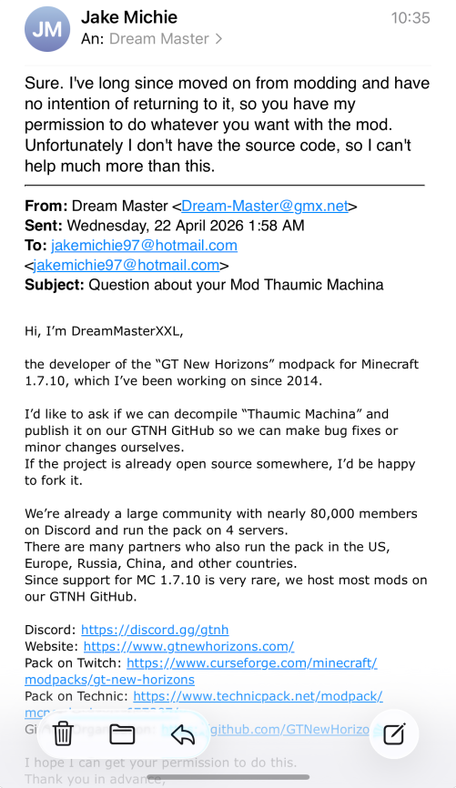

Thaumic Machina is an addon for Thaumcraft 4 which seeks to do one thing: expand Thaumcraft in a more mechanical and theoretical light. To do this, this addon does alter the lore of Thaumcraft and Thaumaturgy as a whole to make the whole "backstory" make more sense. However it does so in a way that does not press onto Thaumcraft or any of its other addons.

## License
This mod has been decompiled and modified by the GTNewHorizons team with permission from the original author:

Original code is available under the [MIT license](https://opensource.org/license/mit) (in the spirit of "do whatever you want with the mod").

GTNewHorizons modifications are available under the terms of the [GNU Lesser General Public License](https://www.gnu.org/licenses/lgpl-3.0.en.html) as published by the Free Software Foundation, either version 3 of the License, or (at your option) any later version.
